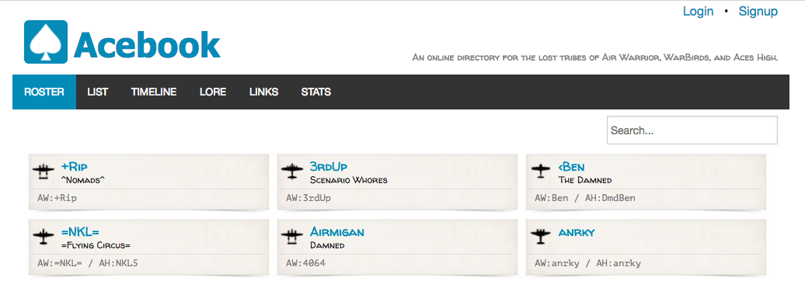

# README #

This was a quick and fun summer project to create an online directory of pilots from vintage
online flight sim games. Some of these relationships go back 35 years, so a need to document
everyone while we were all still breathing was recognized.

This app runs Rails 4 and uses ZURB Foundation for the UI.

There's no test code because this was just recreational coding. 
